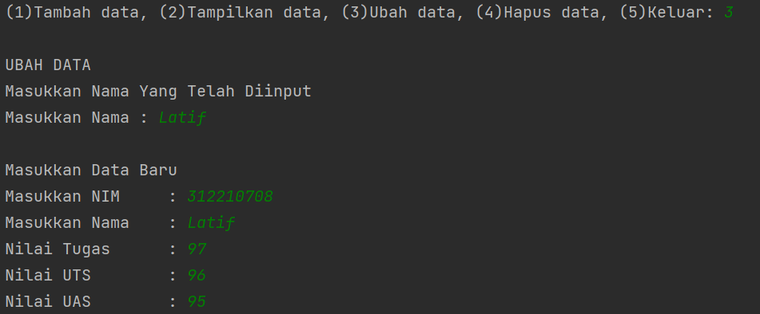

# Praktikum 7
## Program menampilkan nilai mahasiswa


### Membuat class

``` python
    def __init__(self, nim, nama, tugas, uts, uas):
        self.nim = nim
        self.nama = nama
        self.tugas = tugas
        self.uts = uts
        self.uas = uas
```

### Menu "Tambah Data"
Untuk menambahkan data yang akan diinputkan

``` python
    def tambah(self, nim, nama, tugas, uts, uas):
        data.nim.append(nim)
        data.nama.append(nama)
        data.tugas.append(tugas)
        data.uts.append(uts)
        data.uas.append(uas)
```
Output


### Menu "Lihat"
Untuk melihat data yang sudah diinputkan

``` python
 def lihat(self):
        for i in range(len(data.nama)):
            print("|", i + 1, "  |", end="")
            print('{0:<25}'.format(self.nama[i]), end="")
            print("|", self.nim[i], end="")
            print(" |", self.tugas[i], end="")
            print("    |", self.uts[i], end="")
            print("  |", self.uas[i], " | ", end="")
            print(f'{((self.tugas[i] * 30 / 100) + (self.uts[i] * 35 / 100) + (self.uas[i] * 35 / 100)) :.2f}', " |")
```

Output


### Menu "Ubah"
Untuk merubah data yang sudah diinputkan

``` python
 def ubah(self, nim, nama, tugas, uts, uas):
        self.nim[no] = nim
        self.nama[no] = nama
        self.tugas[no] = tugas
        self.uts[no] = uts
        self.uas[no] = uas
```

Output


### Menu "Hapus"
Untuk menghapus data yang sudah diinputkan

``` python
def hapus(self):
        del self.nim[no]
        del self.nama[no]
        del self.tugas[no]
        del self.uts[no]
        del self.uas[no]
```
Output


